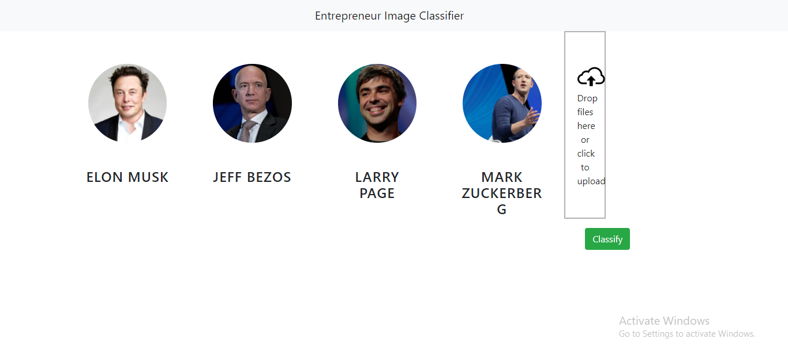
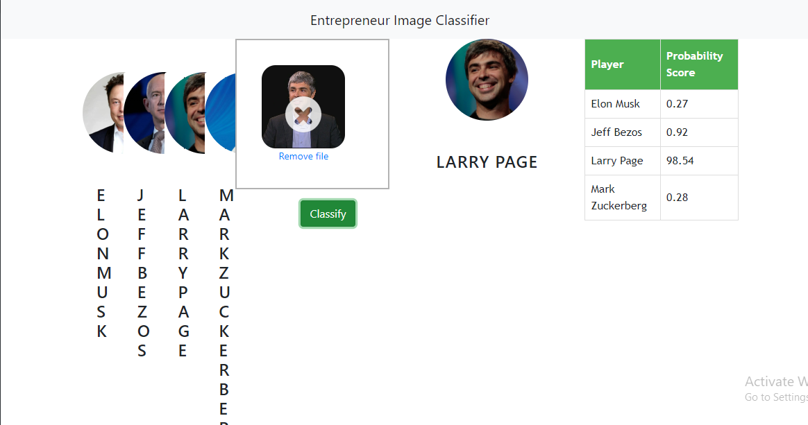

# Entrepreneur-Image-Classifier

## Description
Its an End to End Image classifier Model which will correctly classify the entreprenur image with the help of Machine Learning algorithm.

## Dataset
I have collected the Dataset with the help of **Web Scrapping** in which there are 4 diffrent folders of Entrepreneur with a collection of Images in each folder.

## Implentation
I have gone through several steps like Preprocessing, Data cleaning, Feature Engineering and Model building and the with the help of flask I have builded a web application.
When we will classify the particular Entrepreneur Image like you can see below, it will calculate the probability value and by checking the maximum it will predict the result.

## Technologies used

1. Prgramming Language - Python 3.8
2. Machine Learning Library - Scikit learn
3. Image processing Library - OpenCV
4. Web Technology - Flask, HTML5, JavaScript.

